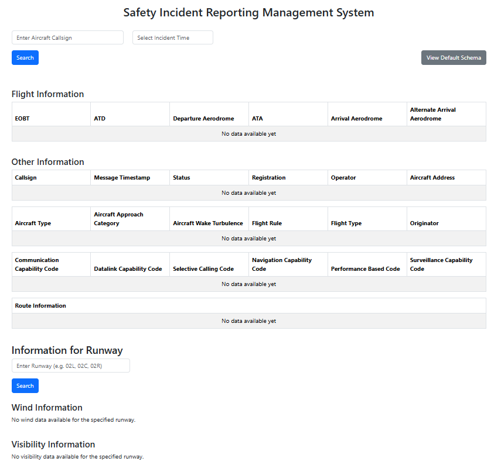

# SIRMS2 Frontend Program
This is a repository for the SIRMS2 React (Frontend) Program. This program contains the prototype forms used in the Safety Incident Reporting Management System.

The actual forms and information used in the final version are not available on GitHub or otherwise publicly available.

Last used in December 2024.

Last updated December 2025: Cleaned up repository and rewrote readme.

## How to run
bash```
npm install
```

bash```
npm run dev
```


